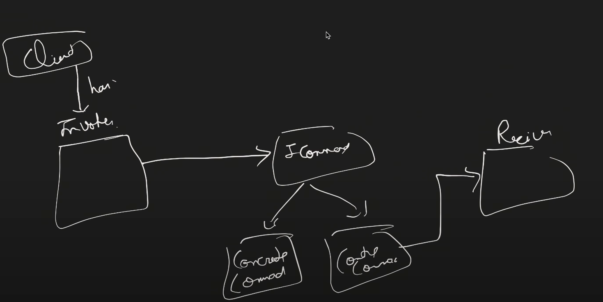

We have to give command to perform operations such as undo redo, turn application on or off or many more, so we have pattern for such problem,
as we dont want to expose the sequence to client and make the code client heavy 
 