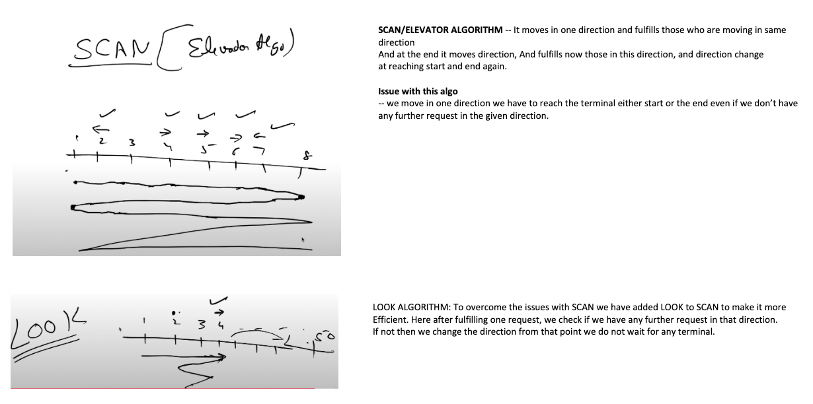
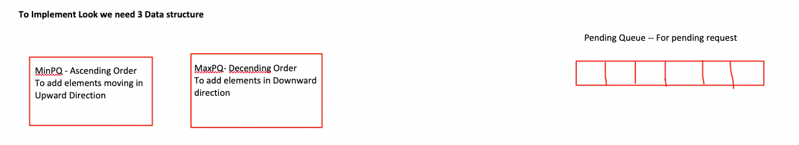
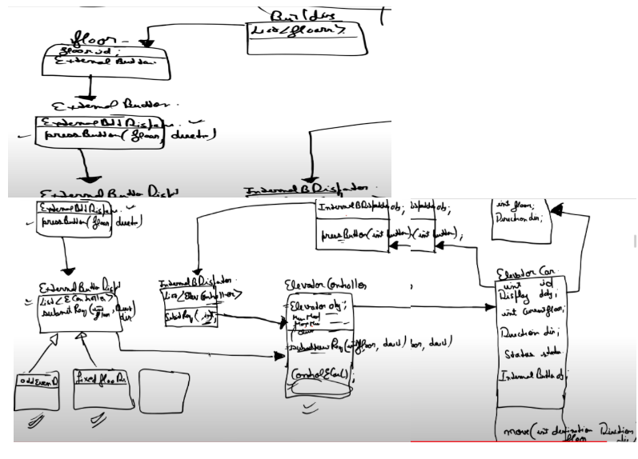

Problem -
Elevator needs to go up and down, based on the input from user that can be at floor
User will enter the  direction at outside and then destination floor when inside lift.
Elevator will have some capacity lets say its 5

Important algorithm for this

Data Structures needed for implementation

Implementation -
* We are 10 storey, at 4 th floor the lift is there moving in upward direction ,
* we got requests for 7,5,9,8 floors moving up, so we will add the requests in min heap to first sort the requests in ascending order,
* 5,7,8,9 and we completed all the request, But at say 8th floor we got request from 5th floor to go up,
* since we now cannot fulfill any request in up direction less that current floor we add them into queue. 
* And When we change the direction from up to down we pop all element from queue and add to min heap, such that when lift again moves in upward direction it will fulfill the upward direction request.
* For Downward motion we fulfill that comes in path by adding them in max heap to order in Desc order since we are moving down, 
* Also those we cant fullfill add them in queue and when at direction change, we pop all element in queue and add them in max heap to process further when we move in downward direction

Rough UML
